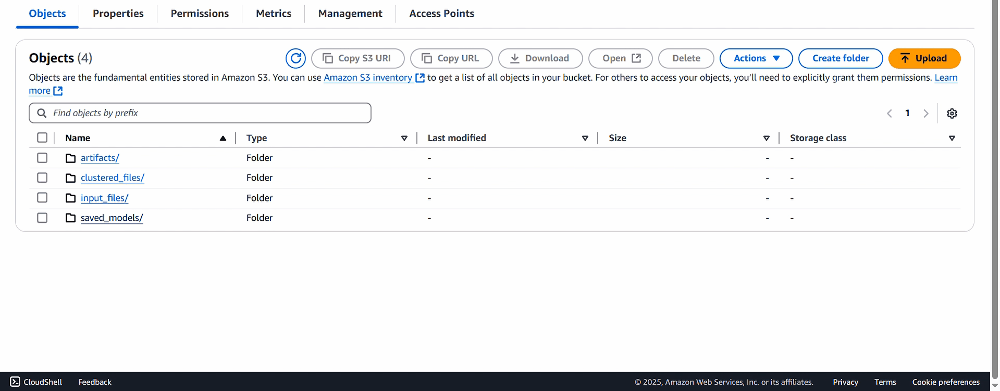

<div align="center">
    
</div>

## 📌 Overview  
Customer Personality Analysis helps businesses understand customer behavior, segment users, and provide personalized recommendations. This project leverages **Machine Learning Operations (MLOps)** to streamline model training, deployment, and monitoring.

## ⚠ Important Note  
- **Python Version:** Please ensure you are using **Python 3.12** to maintain compatibility with the project's dependencies and requirements.

---

## 📂 Project Navigation  
📁 [**Notebooks**](notebooks/) | 📁 [**Pipelines**](src/pipeline/) | 📁 [**Airflow DAGs**](airflow/dags/) | 📁 [**Docs**](docs/) | 📁 [**Deployment**](deployment/)


## 🔹 Apache Airflow Workflow Overview
---

### 📺 **Continuous Training Pipeline (CT)**  
This DAG automates the continuous training of the model, ensuring it stays updated with new data.  

  

---

### 📊 **Cluster Prediction DAG**  
This step runs the clustering model to generate predictions.  

  

---

### ☁️ **S3 Bucket Outputs**  
The S3 bucket stores all generated outputs, including:  
- ✅ **Saved Models**  
- 📂 **Clustered Files**  
- 🔍 **Artifacts**  

  

## 💁️ Project Structure
```
Customer-Personality-Analysis/
│
├── .dockerignore                              # 🚫 Ignore files for Docker
├── .env                                       # 🔑 Environment variables
├── .gitignore                                 # 🚫 Ignore files for Git
│
|── demo/
|   ├── project_full_demo.mp4                  # Full Project Explaination
│   └── gif_demo/                              # gif short demo
| 
├── .github/
│   └── workflows/
│       └── main.yaml                          # ⚙️ GitHub Actions CI/CD pipeline
│
├── airflow/                                   # 💨 Apache Airflow DAGs
│   └── dags/                                  # 📅 Workflow DAGs
│       ├── clustering_pipeline.py             # 🔍 Airflow DAG for clustering
│       └── training_pipeline.py               # 🎯 Airflow DAG for model training
│
├── artifact/                                  # 🐂 Contains all intermediate and final outputs
├── clustered_files/                           # 📂 Clustered processed files
├── data_dump.py                               # 🛋️ Dumps data into MongoDB Atlas
├── docker-compose.yml                         # 🔧 Docker Compose for multi-container setup
├── Dockerfile                                 # 💪 Docker image setup
│
├── LICENSE                                    # 📚 MIT License file
├── main.py                                    # 🚀 Entry point for training and predictions
├── notebook/                                  # 📚 Jupyter notebooks
│   ├── EDA & Feature_Engineering.ipynb        # 🔄 Exploratory Data Analysis
│   ├── Preprocessing & Model_training.ipynb   # 🎓 Model training steps
│
├── README.md                                  # 📖 Project documentation
├── requirements.txt                           # 📌 Dependencies for the project
├── saved_models/                              # 🎯 Production-ready models and transformers
├── setup.py                                   # ⚙️ Package setup for `src`
│
├── src/
│   ├── components/                            # 🏢 Core pipeline components
│   │   ├── data_ingestion.py                  # 📅 Handles data collection
│   │   ├── data_transformation.py             # 🔄 Prepares data for training
│   │   ├── data_validation.py                 # ✅ Validates raw data
│   │   ├── model_evaluation.py                # 📊 Evaluates the model
│   │   ├── model_pusher.py                    # 🚀 Pushes the trained model to deployment
│   │   ├── model_training.py                  # 🎓 Trains the machine learning model
│   │
│   ├── config.py                              # ⚙️ Configuration management and environment variables
│   ├── entity/                                # 📆 Data structures for pipeline
│   │   ├── artifact_entity.py                 # 🐂 Artifacts generated by pipeline stages
│   │   └── config_entity.py                   # ⚙️ Configuration-related entities
│   │
│   ├── exceptions.py                          # ❗ Custom exception handling
│   ├── logger.py                              # 💜 Logging setup
│   ├── pipeline/                              # 🔄 Pipeline automation
│   │   ├── clustering_pipeline.py             # 🔍 Handles clustering predictions
│   │   └── training_pipeline.py               # 🎯 Automates training workflow
│   │
│   └── utils.py                               # 🛠️ Utility functions
```
<h2 align="">Tools and Technologies Used</h2>
<p align="center">
    &nbsp;&nbsp;&nbsp;
    &nbsp;&nbsp;&nbsp;
    &nbsp;&nbsp;&nbsp;
    &nbsp;&nbsp;&nbsp;
    &nbsp;&nbsp;&nbsp;
    &nbsp;&nbsp;&nbsp;
    &nbsp;&nbsp;&nbsp;
    &nbsp;&nbsp;&nbsp;
    &nbsp;&nbsp;&nbsp;
    &nbsp;&nbsp;&nbsp;
    &nbsp;&nbsp;&nbsp;
    
</p>

## 🚀 Step-by-Step Deployment Guide  

### 1️⃣ **AWS EC2 Instance Setup**  
📌 **Steps:**  
- Create an EC2 instance  
- Configure security groups  
- SSH into the instance  

  
**Install Docker:**
   SSH into your EC2 instance and run the following commands:

   ```bash
   curl -fsSL https://get.docker.com -o get-docker.sh
   sudo sh get-docker.sh
   sudo usermod -aG docker ubuntu
   newgrp docker
   docker --version
  ```
> **GitHub Runner Setup(Example):**  
> After SSH-ing into your EC2 instance, set up the GitHub self-hosted runner by executing the following commands:

> ```bash
> # Create a directory for the GitHub Actions runner and navigate into it
> mkdir actions-runner && cd actions-runner
> 
> # Download the latest runner package (update the version as needed)
> curl -o actions-runner-linux-x64-2.322.0.tar.gz -L https://github.com/actions/runner/releases/download/v2.322.0/actions-runner-linux-x64-2.322.0.tar.gz
> 
> # Optional: Validate the has
> echo "b13b784808359f31bc79b08a191f5f83757852957dd8fe3dbfcc38202ccf5768  actions-runner-linux-x64-2.322.0.tar.gz" | shasum -a 256 -c
> 
> # Extract the installer
> tar xzf ./actions-runner-linux-x64-2.322.0.tar.gz
> 
> # Configure the runner (replace <REPO_URL> and <RUNNER_TOKEN> with your repository URL and runner token) 
> ./config.sh --url https://github.com/Rajatsingh64/customer_personality_analysis --token XYZ
> 
> # Start the runner
> ./run.sh
> 
>  
> # Use this YAML in your workflow file for each job
> runs-on: self-hosted
>
>```
> *Note: Ensure you have generated a runner token from your GitHub repository's settings under "Actions" → "Runners" → create "New-self-hosted-runner" → "linux".*

### 3️⃣ **IAM Role & Access Key Setup**  
📌 **Steps:**  
- Create an IAM user  
- Attach necessary policies (e.g., `S3FullAccess`, `EC2FullAccess` , `AdministratorAcess`)  
- Generate `AWS_ACCESS_KEY_ID` & `AWS_SECRET_ACCESS_KEY` 

 ### 2️⃣ **AWS S3 Bucket Creation**  
📌 **Steps:**  
- Navigate to AWS S3  
- Create a bucket  
- Set access permissions  

## 🐳 AWS ECR Creation Steps
### 1️⃣ **Create ECR Repository**  
- Open the **Amazon ECR console** at https://console.aws.amazon.com/ecr.
- Select **Repositories** from the left menu and click on **Create repository**.
- Choose a **private repository** type and provide a **repository name** (e.g., `customer-personality-analysis`).
- Click **Create repository**.

### 4️⃣ **GitHub Repository & Secrets Configuration**  
📌 **Steps:**  
- Create a GitHub repository  
- Navigate to `Settings` → `Secrets and variables` → `Actions`  
- Add the following secrets:  

  | Secret Name              | Description                      |
  |--------------------------|----------------------------------|
  | `AWS_ACCESS_KEY_ID`      | AWS Access Key                   |
  | `AWS_SECRET_ACCESS_KEY`  | AWS Secret Access Key            |
  | `AWS_REGION`             | AWS Region (e.g., `ap-south-1`)  |
  | `BUCKET_NAME`            | S3 Bucket Name                   |
  | `MONGO_DB_URL`           | MongoDB Connection URL           |
  | `ECR_REPOSITORY_NAME`    | AWS ECR Repository Name          |
  | `AWS_ECR_LOGIN_URI`      | AWS ECR Login URI                |
  | `AIRFLOW_EMAIL`          | Airflow User Email               |
  | `AIRFLOW_USERNAME`       | Airflow  Admin Username          |
  | `AIRFLOW_PASSWORD`       | Airflow Admin Password           |
 
### 5️⃣ **GitHub Actions CI/CD (`main.yml`)**  
📌 **Steps:**  
- Configure `.github/workflows/main.yml`  
- Automate deployment to AWS  

📄 **GitHub Actions Workflow:**  
[](.github/workflows/main.yml)

# Important Notes

## Triggering Workflow:
- **To trigger the workflow**: Ensure that you **push a commit** to the repository. This will automatically trigger the workflow set up in the CI/CD pipeline.

## Modifying Inbound Rules for Port 8080:
When deploying or working with a service that needs to expose port 8080, follow these steps to update the inbound rules:

### Steps to Configure:
1. **Go to your cloud provider's dashboard** (AWS, Azure, etc.).
2. **Navigate to the Security Group** or **Firewall** section where your server or instance is located.
3. **Modify the Inbound Rules**:
   - Add a new inbound rule to allow traffic on port **8080**.
   - Select **Custom TCP Rule** for the protocol.
   - Set the **Port Range** to `8080`.
   - Choose **Source**: Either a specific IP range or `0.0.0.0/0` for public access (use cautiously for security reasons).
4. **Save the changes**.

This ensures that external traffic can access your application on port 8080.
## 🚀 Connect with Me  

<p align="center">
    <a href="https://github.com/Rajatsingh64" target="_blank">
        
    </a>
    <a href="https://www.linkedin.com/in/rajat-singh-292124240" target="_blank">
        
    </a>
    <a href="mailto:rajat.k.singh64@gmail.com">
        
    </a>
</p>

<p align="center">
    💻 Developed by <strong>Rajat Singh</strong> | ⚡ Powered by Passion & Code  
</p>

<p align="center">
    
</p>


